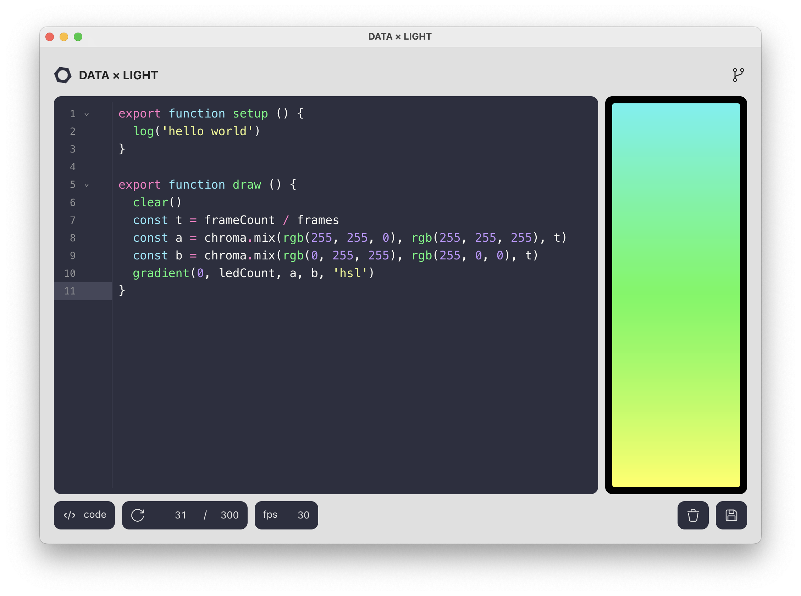

# workshop-data-light

## Documentation

See [docs/reference](docs/reference.fr.md) (fr).

## Development

```console
# Development
$ yarn start
$ yarn test

# Staging
$ yarn build
$ yarn preview
$ yarn deploy:staging

# Production
$ yarn version
```

## Credits

JSX and state utils heavily based on [**pqml**](https://github.com/pqml)’s work.

## License
[MIT.](https://tldrlegal.com/license/mit-license)


